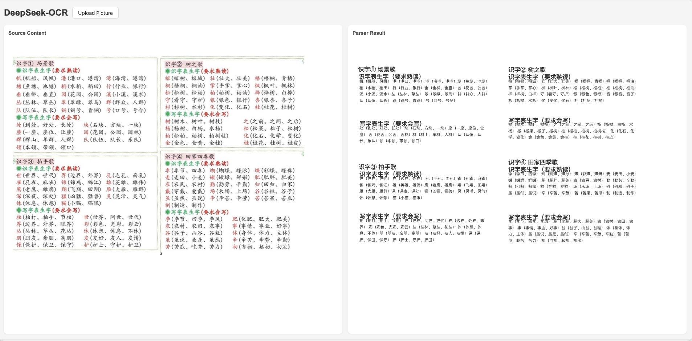

## deepseek-ocr-react

基于 **React + Ant Design + Rsbuild** 的轻量级文档 OCR 预览与标注 Demo。  
应用负责：

- **上传图片**：通过 Ant Design `Upload` 组件选择本地图片；
- **调用后端 OCR 接口**：使用 `src/api/index.ts` 中的 `ocr` 方法发送 Base64 图片到后端；
- **解析模型返回结果**：使用 `parser` 将模型返回的标注结果抽取为结构化数据；
- **在原图上叠加可视化结果**：根据坐标信息，在图片上叠加文字 / 区域高亮。

> 注意：本仓库只包含前端页面与解析逻辑，OCR 能力基于本地部署的 **Ollama + DeepSeek-OCR 模型** 提供，前端通过 `src/api/index.ts` 中的 `ocr` 方法调用本地服务。




---

### OCR 接口与本地 Ollama 部署

- 本项目假设你已经在本机通过 **Ollama** 部署了 DeepSeek OCR 相关模型，并暴露了 HTTP 接口；
- 前端在 `src/api/index.ts` 中，将上传图片的 Base64 编码（去掉前缀，如 `data:image/png;base64,`）发送到本地 Ollama 服务；
- 后端（Ollama + 模型）返回带有坐标与内容的字符串，前端使用 `parser` 解析并在图片上进行可视化标注。

你可以根据自己的本地环境调整：

- Ollama 模型名称（例如 `deepseek-ocr`）；
- 本地服务地址（如 `http://localhost:11434`）；
- `src/api/index.ts` 中的请求路径与参数格式。

---

### 安装依赖

项目使用 `pnpm` 作为包管理工具：

```bash
pnpm install
```

如未安装 pnpm，可先执行：

```bash
npm install -g pnpm
```

---

### 本地开发

启动开发服务器，默认运行在 `http://localhost:3000`：

```bash
pnpm run dev
```

推荐在浏览器中打开后：

- 在左侧区域上传一张含有文本/表格的图片；
- 等待后端返回 OCR 结果后，右侧会展示解析后在图片上的可视化内容。

---

### 构建与预览

- **构建生产包**：

```bash
pnpm run build
```

- **本地预览生产构建结果**：

```bash
pnpm run preview
```

---

### 技术栈

- **构建工具**：Rsbuild
- **前端框架**：React 18
- **组件库**：Ant Design 6
- **样式**：Sass（`App.scss`、组件级样式）
- **其他**：
  - `axios`：请求后端 OCR 接口（见 `src/api`）
  - `marked` + `dompurify`：安全地渲染 OCR 结果中的 Markdown / HTML 片段

---

### 目录结构（核心部分）

- `src/App.tsx`：应用入口布局，负责文件上传与结果展示区域
- `src/components/uploader.tsx`：图片上传组件，负责文件读取为 Base64 并回调给上层
- `src/components/result.tsx`：OCR 结果可视化组件，根据坐标在原图上叠加文字 / 图块
- `src/utils/parser.ts`：解析模型返回字符串为结构化坐标与内容
- `src/api/index.ts`：封装与后端 OCR 接口的通信（需结合你自己的后端实现）

---

### Rsbuild 相关

本项目由 Rsbuild 创建和构建。  
更多关于 Rsbuild 的用法可参考：

- [Rsbuild 文档](https://rsbuild.rs)
- [Rsbuild GitHub 仓库](https://github.com/web-infra-dev/rsbuild)

